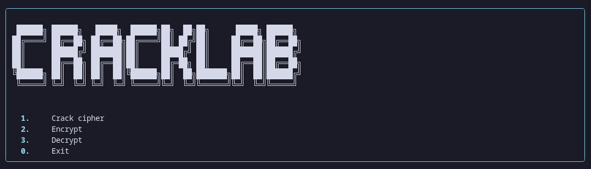
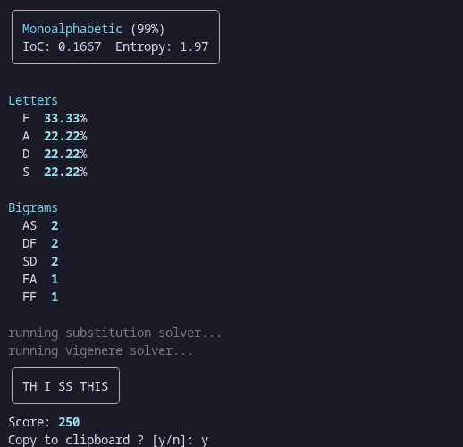

# Cracklab

this is a tool for decrypting and analyzing ciphers

## Supported Ciphers & Encodings
- Monoalphabetic substitution cipher cracking
- Caesar cipher
- Vigenère cipher
- Base64 decoding
- Base32 decoding
- Hex decoding
- Binary decoding
- Morse code decoding

---

## Features 
- Frequency analysis
- Index of coincidence
- Entropy analysis
- Bigram analysis
- Pattern and dictionary matching
- English text scoring
- Key-based encryption and decryption
- Copy encrypted, decrypted, and cracked results to the clipboard

## How it works 
1) tries to identify the type of cipher or encoding.

2) Simple encodings such as Base64, Base32, Hex, Binary, and Morse are decoded directly.

3) For Caesar ciphers, it tries possible shifts and scores the results based on how closely they resemble English.

4) For monoalphabetic substitution ciphers it uses an iterative solver.


## Usage

### Linux executable

Made an executable for linux only 
If you are using windows or mac please build from source.

run using this from same dir

```bash
chmod +x crack
./crack
```

### Build from source

```bash
git clone https://github.com/Eraxty/Cracklab.git
cd Cracklab
```

Install the dependencies:

```bash
python -m pip install -r requirements.txt
```

Run CrackLab

```bash
python main.py
```

On Windows, use `py` instead of `python` if that is the Python launcher
available on your system, for example `py main.py`.

### How to use 

Select option `1` and enter the ciphertext.
Example:-

```text
Enter ciphertext:
> SEVMTE8gV09STEQ=

Cipher: Base64 (99%)

Decoded:
HELLO WORLD
```


It will analyze the input, detect its likely type, and run the appropriate decoder or solver.


## Release

The release is intended for:

```text
Architecture: x86_64
OS: Arch Linux
```


## Screenshots





### Encryption

Select option `2` and enter a message.

It generates an encrypted message with a key

### Decryption

Select option `3`, then enter the encrypted text with its key.


## Solver

The substitution solver does not simply replace letters based on frequency.

It combines several methods:

- Letter frequency analysis
- Repeated word patterns
- Dictionary candidate matching
- Partial plaintext matching
- N-gram scoring
- Common word scoring
- Mapping consistency
- Iterative candidate refinement

## Requirements

Install any project dependencies using:

```bash
pip install -r requirements.txt
```
## Use of AI

AI was used while making the iterative solver because I couldn't figure it out, Even with AI, it took hours of testing and changing the approach before it finally worked.But then i removed the ai code

AI was also used for smaller things that made development easier, like generating word dictionaries, test data, and helping debug parts of the project.
